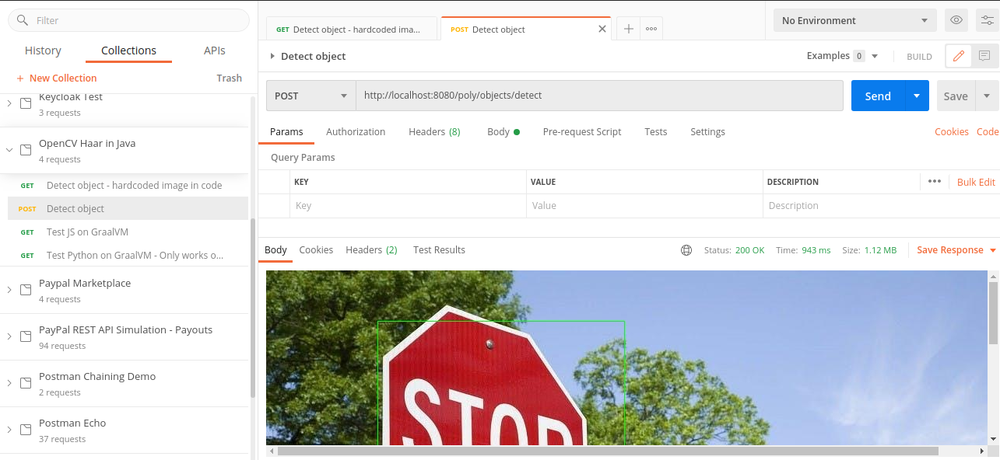

# OpenCV Haar Java Backend Application Challenge

At the heart of many machine vision solutions is a software package named OpenCV. Since I'm a Java developer, I'm wondering if I can take advantage of this Python library inside a Java application.

In this project, I created a backend application that can be tested using CURL or Postman that will integrate a
simple OpenCV application. The API endpoint or endpoints handle all the inputs required
by the application. Link to the OpenCV application can be found here:
https://www.geeksforgeeks.org/detect-an-object-with-opencv-python/

This exercise is done using Quarkus, a serverless framework for JavaEE.
To use the OpenCV, it is compiled to generate a jar and so library that is used by the Java application.

## Packaging and running the application

The application can be packaged using:
```shell script
./mvnw package
```
It produces the `opencv-haar-java-1.0.0-SNAPSHOT-runner.jar` file in the `/target` directory.
Be aware that it’s not an _über-jar_ as the dependencies are copied into the `target/lib` directory.

You can then execute your native executable with: `./target/opencv-haar-java-1.0.0-SNAPSHOT-runner`

## Build the dockerfile

After building the project, the docker image can now be created.

It creates a container from Ubuntu 20.04 with the following components:

- OpenJDK 11
- Python3 (OpenCV)
- PIP
- Cmake

It checks out the OpenCV code 4.5.1 and builds the library that will be used by the Java app.

```shell script
docker build -f src/main/docker/Dockerfile.jvm -t quarkus/opencv-haar-java-jvm .
```

To run the application execute
```shell script
docker run -i --rm -p 8080:8080 quarkus/opencv-haar-java-jvm
```

## API

Open API documentation is accessible at http://localhost:8080/q/openapi.

Swagger UI is accessible at http://localhost:8080/q/swagger-ui.

## Testing

To test this application Open the "OpenCV Haar in Java" Postman collection inside the test folder.

- Detect object - process a hardcoded image in code
- Detect object - accepts an image parameter and a filename use to cache the processed image. Make sure to change the attached image as it is lost during transfer.


